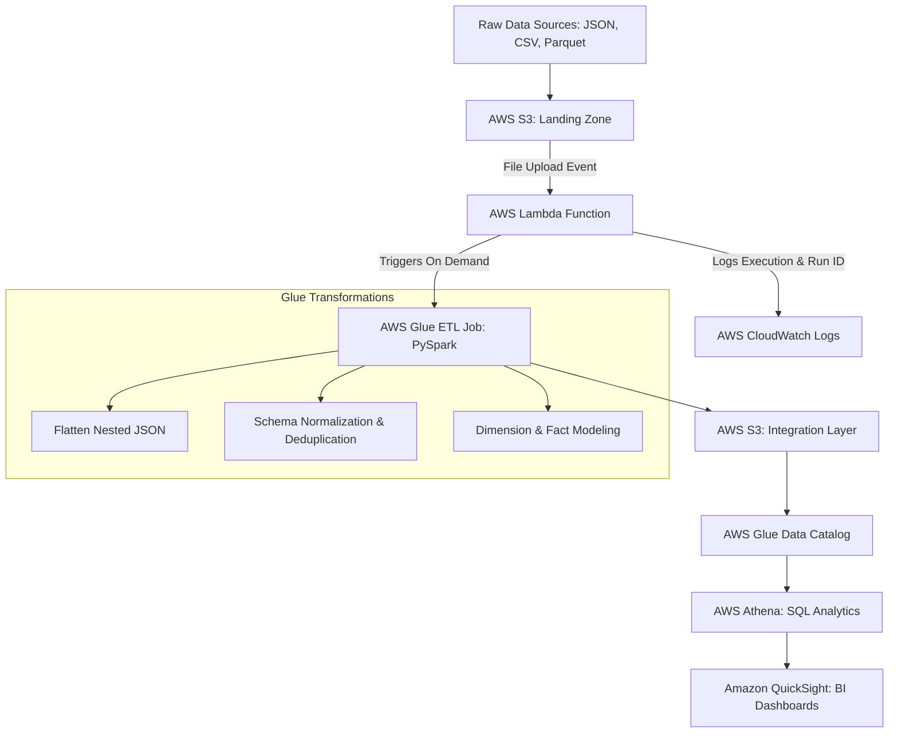

# Serverless AWS Data Pipeline: LinkedIn Job Market Trends Analytics

An end-to-end serverless data engineering pipeline built on AWS to ingest, transform, model, and visualize global LinkedIn job posting trends across geographic, industry, and experience dimensions.

---

## Architecture & Data Flow


---

## Project Overview & Objectives

The goal of this project is to analyze dynamic job market data to extract operational and strategic insights for job seekers, recruiters, and workforce planners. 
* **Strategic Insights:** Identifies high-opportunity regions, growing sectors, and in-demand experience levels.
* **Operational Insights:** Powers targeted recruitment strategies and educational curriculum alignment based on real-world hiring trends.

---

## Data Modeling & Dimensional Architecture

The data warehouse follows a **Star Schema** design optimized for analytical querying in Athena:

### Fact Table
* **`Job Postings Table`**: Contains granular metrics including `max_salary`, `min_salary`, `med_salary`, `views`, `applies`, `skills_count`, `active_post_days`, and `engagement_score`.

### Dimension Tables
1. **`Calendar Dimension`**: Date $\rightarrow$ Month $\rightarrow$ Quarter $\rightarrow$ Year (prepopulated via PySpark).
2. **`Location Dimension`**: ZIP Code $\rightarrow$ City $\rightarrow$ State $\rightarrow$ Country hierarchy.
3. **`Jobs Dimension`**: Job title, work type, pay period, remote status, and experience level.
4. **`Companies Dimension`**: Company name, employee count, and follower count.
5. **`Industries Dimension`**: Standardized industry categorization.
6. **`Benefits & Skills Dimensions`**: Normalized mapping tables for job perks and required technical skill sets.

---

## Tech Stack & Pipeline Components

* **Ingestion Storage:** **AWS S3 (`linkedinjobs24` bucket)** structured into `landing_zone`, `integration_layer`, and `query_results`.
* **Data Formats Handled:** 
  * **JSON (`benefits_flattened.json`):** Flattened nested structures.
  * **CSV (`companies_filtered.csv`):** Tabular standard loading.
  * **Parquet (`postings.parquet`):** Optimized columnar storage natively supported by AWS Glue/Athena.
* **Orchestration & Compute:** **AWS Lambda** (Python) triggered automatically upon file landing, initiating **AWS Glue PySpark ETL Jobs**.
* **Processing Framework:** **PySpark & Pandas** for custom data cleaning, schema enforcement, column standardizations (`snake_case`), and derived metrics (`engagement_score`, normalized yearly salaries).
* **Cataloging & Querying:** **AWS Glue Crawlers & Data Catalog** paired with **AWS Athena** for serverless SQL analytics.
* **Monitoring & Governance:** **AWS CloudWatch** (execution logs and run IDs) secured via **IAM Roles** (`AWSLambdaBasicExecutionRole`, `AWSGlueServiceRole`).
* **Visualization:** **Amazon QuickSight** dashboards mapping market demand trends.

---

## Repository Structure

```text
    linkedin-job-trends-pipeline/
├── README.md                                        # Comprehensive project documentation & execution order
├── architecture/                                    # Visual diagrams & schemas
│   ├── AWS_serverless_analytics_data_pipeline.png   # AWS data flow diagram
│   ├── conceptual_model.png                         # High-level business domains and data flow
│   └── relational_model.png                         # Star schema / ERD diagram
├── glue_jobs/                                       # PySpark ETL jobs & notebooks
│   ├── dimensions/                                  # Master dimension loading scripts
│   │   ├── calendar_job.py
│   │   ├── companies_job.py
│   │   ├── jobs_job.py
│   │   ├── industries_job.py
│   │   └── benefits_job.py
│   ├── bridges/                                     # Many-to-many relationship mapping scripts & notebooks
│   │   ├── companies_industries_job.py
│   │   ├── jobs_skills_job.py  
│   │   └── jobs_benefits_job.py
│   └── fact/                                        # Fact table loading scripts
│       └── job_postings_fact_job.py
├── sql/                                             # Database schemas & analytical queries
│   ├── ddl/                                         # Athena table creation scripts
│   │   ├── dimensions_ddl.sql                       # DDLs for all dimension tables
│   │   ├── bridges_ddl.sql                          # DDLs for all bridge/junction tables
│   │   └── facts_ddl.sql                            # DDL for job_postings_fact
│   └── analytics_views.sql                          # Core queries used for QuickSight reporting
├── lambda/                                          # Event-driven automation
│   └── lambda_trigger.py                            # Lambda function script to trigger Glue
└── visualizations/                                  # Visualization graphs
    ├── applications_across_industries.png
    └── applications_per_job.png
    └── job_postings_by_experience.png
    └── jobs_posting_correlation.png
    └── top_industries-companies_applications.png
```

---

## Key Visualizations & Insights
*Key visualization charts for the analytics conducted*